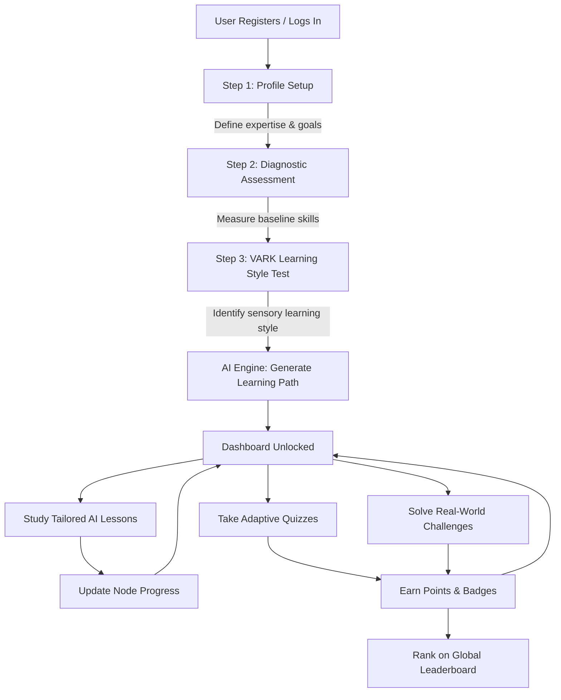

# AptitudeAI 🚀 — AI-Powered Adaptive Learning Platform

AptitudeAI is a state-of-the-art, highly personalized aptitude training web application. By combining diagnostic assessments, VARK cognitive style profiles, and OpenAI's GPT-3.5 engine, it dynamically constructs custom training programs, adaptive quizzes, and gamified leaderboards to speed up learning and skill retention.

---

## 📖 Table of Contents
1. [🌟 Platform Overview](#-platform-overview)
2. [🗺️ How It Works (User Journey)](#️-how-it-works-user-journey)
3. [🧠 The Cognitive Personalization Engine](#-the-cognitive-personalization-engine)
4. [🛠️ Tech Stack & Architecture](#️-tech-stack--architecture)
5. [📁 Repository Structure](#-repository-structure)
6. [📋 Prerequisites](#-prerequisites)
7. [⚙️ Step-by-Step Installation & Setup](#️-step-by-step-installation--setup)
8. [🚀 Running the Application](#-running-the-application)
9. [💾 Database Schema & Data Models](#-database-schema--data-models)
10. [🔑 Core API References](#-core-api-references)
11. [🔧 Troubleshooting & FAQs](#-troubleshooting--faqs)
12. [🤝 Contributing Guidelines](#-contributing-guidelines)

---

## 🌟 Platform Overview

AptitudeAI is built for job-seekers, engineering students, and professionals aiming to ace aptitude tests (Quantitative, Logical, Verbal, and Data Interpretation). Unlike static study portals, AptitudeAI tailors the curriculum in real time based on **how** you learn best and **what** your exact weaknesses are.

---

## 🗺️ How It Works (User Journey)

The flow diagram below demonstrates the complete lifecycle of a user onboarding and learning within the system:



---

## 🧠 The Cognitive Personalization Engine

### 1. VARK Model Integration
Sensory inputs heavily influence how information is retained. The platform identifies your primary learning mode:
*   **Visual**: Adapted to video tutorials, diagrams, and maps (estimated study time adjusted to $90\%$ of base duration).
*   **Auditory**: Tailored with audio explanations, read-aloud descriptions, and group discussions ($95\%$ of base duration).
*   **Reading/Writing**: Emphasizes detailed text articles, documentation, worksheets, and case studies ($100\%$ of base duration).
*   **Kinesthetic**: Heavy emphasis on interactive exercises, mock test simulations, and direct practice questions ($110\%$ of base duration).

### 2. The Adaptive Quiz Engine
When a user takes a quiz:
*   The system begins at a baseline difficulty matching their profile preferences.
*   **Correct Answers** increase current streaks, award higher point weights, and ramp up difficulty towards expert levels.
*   **Incorrect Answers** trigger real-time AI feedback highlighting what formula or logical step went wrong, and adjust subsequent question difficulty down to reinforce foundations.

---

## 🛠️ Tech Stack & Architecture

The application splits responsibilities into a decoupled multi-tier architecture:

```
┌─────────────────────────────────────────────────────────┐
│                      Client Layer                       │
│  React (v18) + Router v6 + Framer Motion + TailwindCSS  │
└───────────┬─────────────────────────────────▲───────────┘
            │                                 │
            │ HTTP (Axios API Requests)       │ JSON Responses
            ▼                                 │
┌─────────────────────────────────────────────┴───────────┐
│                  Application API Layer                  │
│       Node.js (v18+) + Express Server + JWT Auth        │
└───────────┬─────────────────────────────────▲───────────┘
            │                                 │
            │ SQL Queries                     │ OpenAI API Prompts
            ▼                                 ▼
┌──────────────────────────────┐   ┌──────────────────────┐
│       Database Layer         │   │   External Services  │
│      PostgreSQL (v14+)       │   │        OpenAI        │
└──────────────────────────────┘   └──────────────────────┘
```

*   **Frontend SPA**: A single-page application built on React, featuring modular layouts, Framer Motion transitions, and Tailwind styling.
*   **Backend API**: An Express.js server providing routing, rate-limiting security guards, and authentication middleware.
*   **Database**: PostgreSQL relational database holding core state, analytics logs, and gamification ranks.

---

## 📁 Repository Structure

```
aptitude-training-app/
├── README.md               # Main documentation
├── .gitignore              # Git ignore rules for root
└── aptitude-training-app/  # Core project directory
    ├── backend/            # Express Node Server
    │   ├── src/
    │   │   ├── config/     # DB connections (pg Pool) & Passport Config
    │   │   ├── controllers/# Business logic & controllers (Auth, Dashboard)
    │   │   ├── middleware/ # Token verification & API rate-limit bounds
    │   │   ├── models/     # Relational Query wrappers (User, Profile)
    │   │   ├── routes/     # Express route groupings
    │   │   ├── services/   # OpenAI service logic for dynamic prompts
    │   │   └── app.js      # App startup entry point
    │   ├── database/       # DB schema.sql and seed files
    │   ├── .env.example    # Configuration example template
    │   └── package.json
    └── frontend/           # React SPA
        ├── public/         # Static entry HTML
        ├── src/
        │   ├── components/ # Common Navbar, Footer, and Onboarding components
        │   ├── context/    # Global Auth State (User context, token refresh)
        │   ├── pages/      # Dashboards, Profiles, Product, and Resource pages
        │   ├── services/   # Axios client configuration & API mapping functions
        │   ├── styles/     # Tailwind & global CSS styles
        │   ├── App.js      # Router routes definition
        │   └── index.js    # React entry index
        ├── .env            # Environment config (Port/API endpoint url)
        └── package.json
```

---

## 📋 Prerequisites

Make sure the following platforms are installed on your server or workspace:
*   [Node.js](https://nodejs.org/) (v16.0.0 or higher)
*   [PostgreSQL](https://www.postgresql.org/) (v14.0.0 or higher)
*   An active [OpenAI API Key](https://platform.openai.com/)
*   (Optional) Google Console OAuth credentials.

---

## ⚙️ Step-by-Step Installation & Setup

### Step 1: Database Setup
1.  Connect to your PostgreSQL server via your terminal CLI or GUI editor:
    ```bash
    psql -U postgres
    ```
2.  Run the database creation command:
    ```sql
    CREATE DATABASE aptitude_training;
    ```
3.  Exit and import the database schema to build the tables, indices, and default badges:
    ```bash
    psql -U postgres -d aptitude_training -f aptitude-training-app/backend/database/schema.sql
    ```

### Step 2: Backend Setup
1.  Navigate into the backend directory:
    ```bash
    cd aptitude-training-app/backend
    ```
2.  Install all packages:
    ```bash
    npm install
    ```
3.  Copy the example environment template:
    ```bash
    cp .env.example .env
    ```
4.  Open the newly created `.env` file and fill in your configurations:
    ```env
    PORT=5000
    DB_HOST=localhost
    DB_PORT=5432
    DB_NAME=aptitude_training
    DB_USER=your_postgres_username
    DB_PASSWORD=your_postgres_password
    JWT_SECRET=your_secret_token
    JWT_REFRESH_SECRET=your_refresh_token
    JWT_EXPIRE=30d
    JWT_REFRESH_EXPIRE=7d
    
    OPENAI_API_KEY=your_openai_api_key
    OPENAI_MODEL=gpt-3.5-turbo
    
    FRONTEND_URL=http://localhost:3002
    ```

### Step 3: Frontend Setup
1.  Navigate to the frontend directory:
    ```bash
    cd ../frontend
    ```
2.  Install dependencies:
    ```bash
    npm install
    ```
3.  Create or verify your `.env` configuration file:
    ```env
    PORT=3002
    REACT_APP_API_URL=http://localhost:5000/api
    REACT_APP_API_TIMEOUT=30000
    REACT_APP_GOOGLE_CLIENT_ID=your_google_client_id.apps.googleusercontent.com
    REACT_APP_APP_NAME=AptitudeAI
    ```

---

## 🚀 Running the Application

For a local development environment, run the servers simultaneously:

### 1. Launch the Backend Server
```bash
cd aptitude-training-app/backend
npm run dev
# The backend API will begin listening at http://localhost:5000/api
```

### 2. Launch the Frontend Server
```bash
cd aptitude-training-app/frontend
npm start
# The React application will load at http://localhost:3002
```

---

## 💾 Database Schema & Data Models

AptitudeAI uses a highly normalized PostgreSQL structure designed for data integrity:

*   `users`: Stores credentials, creation dates, active states, and onboarding checklists.
*   `user_profiles`: Keeps professional context (expertise, preferred difficulty, weekly study hour constraints).
*   `learning_style_assessments`: Tracks visual, auditory, reading, and kinesthetic test answers to calculate VARK targets.
*   `learning_path_nodes`: Represents specific milestones generated by the AI parser.
*   `user_learning_progress`: Tracks completion progress percentages and mastery metrics for path nodes.
*   `leaderboard`: Maintains user ranking, point totals, streak metrics, and achievements logs.
*   `badges`: Stores reward metadata (badges, icons, and points required) created automatically.

---

## 🔑 Core API References

All requests must contain a valid JWT header: `Authorization: Bearer <token>` (except login and register).

| Method | Endpoint | Description |
| :--- | :--- | :--- |
| **POST** | `/api/auth/register` | Register a new user |
| **POST** | `/api/auth/login` | Log in and receive JWT and refresh tokens |
| **GET** | `/api/auth/me` | Fetch authenticated user data (normalized) |
| **POST** | `/api/auth/refresh-token` | Fetch a new token using the refresh key |
| **GET** | `/api/dashboard/data` | Fetch dashboard user stats, learning modules, and chart data |
| **GET** | `/api/dashboard/learning-content`| Fetch AI-personalized lessons |
| **POST**| `/api/learning/generate-path` | Trigger AI to generate user study path |
| **GET** | `/api/gamification/leaderboard` | Fetch rankings, streaks, and user ranks |

---

## 🔧 Troubleshooting & FAQs

### Q: The screen is completely blank on navigating to `localhost:3002/dashboard`.
*   **A**: This is typically caused by a routing redirect mismatch if the browser cache contains an unnormalized user object (such as direct database results with `onboarding_completed` instead of the required frontend camelCase `onboardingCompleted`).
*   **Fix**: Clear your browser's local storage (`localStorage.clear()`) and sign in again. The updated [AuthContext](file:///c:/Desktop/Project/aptitude-training-app/aptitude-training-app/frontend/src/context/AuthContext.jsx) wrapper automatically normalizes these fields to prevent this issue.

### Q: I get database connection error `Error connecting to database`.
*   **A**: Ensure your PostgreSQL service is running. Check your credentials (`DB_USER`, `DB_PASSWORD`, `DB_PORT`) in the backend [dotenv configuration file](file:///c:/Desktop/Project/aptitude-training-app/aptitude-training-app/backend/.env).

### Q: The AI lesson content generator returns an error or loading fails.
*   **A**: Verify that your `OPENAI_API_KEY` is correctly configured in your backend `.env` file and that your account balance supports the request.

---

## 🤝 Contributing Guidelines

1.  Create a feature branch: `git checkout -b feature/your-feature-name`.
2.  Format your code and verify there are no linter errors.
3.  Test your production bundle before staging files:
    ```bash
    npm run build
    ```
4.  Stage changes:
    ```bash
    git add .
    ```
5.  Commit changes:
    ```bash
    git commit -m "feat: description of modifications"
    ```